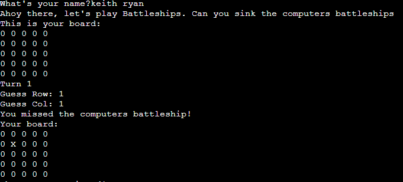
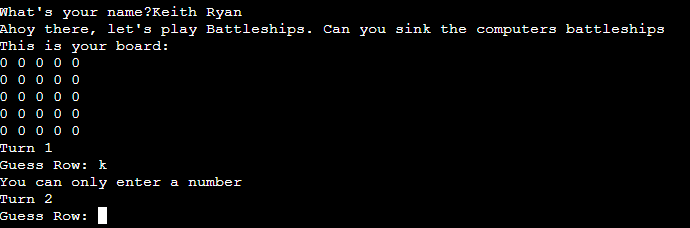
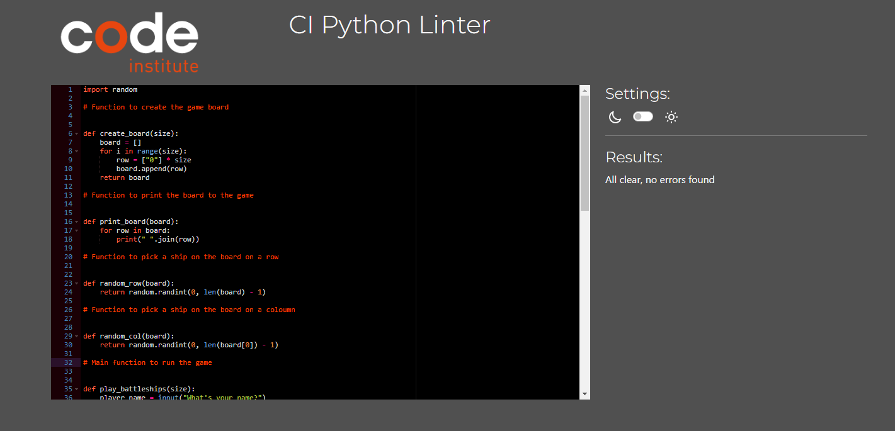

# Battleships

Welcome ryan7984,

Battle ships is a Python terminal game running in the Code Institute mock terminal on Heroku. 

Users can try and beat the computer by finding all of the computer's battleships before the computer finds theirs. Each battleship occupies one square on the board 

Here is a live version of my project 

## How to play
----------------------------------------------------
1. The player enters their name. 
2. There are separate boards for the player and the computer. 
3. The player and computer take turns guessing where each others ships are on the board to sink each others ships.
4. The player gets 4 attempts after that the player is notified the game is over. 
5. The player/computer that sinks all of their opponents ships within four attempts wins. 

----------------------------------------------------------------------------
## Features 

- The ships are not seen unless they have been hit and sunk. 

- The player cannot enter coordinates outside the size of the grid. 
- The player must enter numbers/integers not letters etc.
- The player cannot enter the same coordinates twice. 

---------------------------------------------------------------------------
## Future Features

- Graphics
- Difficulty levels
- Leaderboard
- Sound effects
- Multiplayer option
- Tutorial 

---------------------------------------------------------------------------
## Testing

- I have manually tested this project by putting it through the PEP8 Linter, giving it invalid imputs and testing it in the Heroku terminal. 

## Bugs 

- Error for "board not defined", amended error to computer_board 
- Amended white space errors 
- Errors for comment sections rectified by adding spaces after #
- Indentation errors rectified by carrying out corretc indentation, 4 spaces etc. 

## Remaining Bugs 

- No remaining bugs 

## Remaining Bugs 

## Deployment
The project was deployed using Code Intitutes mock terminal Heroku.

- Steps for deployment:

 1. Create a Heroku account. 
 2. Fill out the form 
 3. Click on create new app on the dashboard. 
 4. Name the app and select Europe as Region
 5. Under the option deploy Github as the deployment method and link Heroku to 
    you prefered github repository by the repositorys name in github. 
 6. Select settings and add a Config Var .The key is PORT and the value is 8000.
 7. Click on deploy branch and when this process has finished click on Open App

## Credits 

As well as using my course material and also found youtube channles usefull such as freeCodecamp.org and programming with Mosh.

